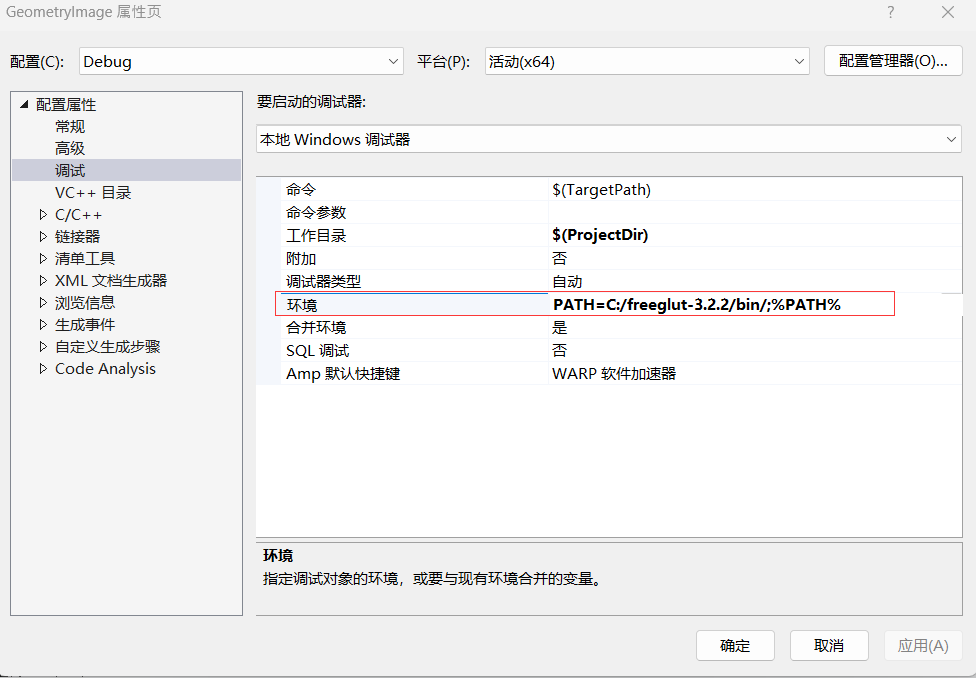
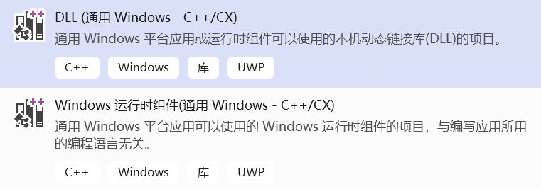
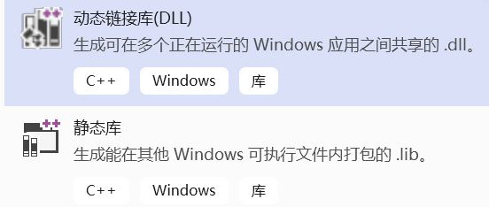

# Windows Application Development Relevant Articles
Windows应用开发相关

<br />

- [开发 Windows 10 应用程序](https://docs.microsoft.com/zh-cn/learn/paths/develop-windows10-apps/)
- [通用 Windows 平台文档](https://docs.microsoft.com/zh-cn/windows/uwp/)
- [Windows Presentation Foundation](https://docs.microsoft.com/en-us/dotnet/framework/wpf/)
- [Windows Forms](https://docs.microsoft.com/en-us/dotnet/framework/winforms/)
- [Direct Machine Learning (DirectML)](https://docs.microsoft.com/en-us/windows/ai/directml/dml)
- [Create an offline installation package of Visual Studio for local installation](https://learn.microsoft.com/en-us/visualstudio/install/create-an-offline-installation-of-visual-studio)（直接看这个篇章：**Use the command line to create a local layout**）
- [How to: Enable a 64-Bit, x64 hosted MSVC toolset on the command line](https://learn.microsoft.com/en-us/cpp/build/how-to-enable-a-64-bit-visual-cpp-toolset-on-the-command-line)（比如：`"C:\Program Files (x86)\Microsoft Visual Studio\2019\Professional\VC\Auxiliary\Build\vcvarsall.bat"  x64  10.0.19041.0`）
- [如何用Visual Studio编写并实时预览Markdown文件](https://blog.csdn.net/qq_35504602/article/details/108054416)
- [获取WINDOWS下当前用户路径 USERPROFILE](https://blog.csdn.net/woodsp/article/details/51922920)（MS-DOS中回显变量值也是用echo）
- [windows上 set 命令的使用](https://jingyan.baidu.com/article/ab0b56303e0c63c15afa7dfe.html)
- [Detecting architecture at compile time from MASM/MASM64](https://stackoverflow.com/questions/2595550/detecting-architecture-at-compile-time-from-masm-masm64)
- [How do I render my DirectX C++ engine to a C# Panel?](https://gamedev.stackexchange.com/questions/124249/how-do-i-render-my-directx-c-engine-to-a-c-panel)
- [Calling Native Functions from Managed Code](https://docs.microsoft.com/en-us/cpp/dotnet/calling-native-functions-from-managed-code?view=vs-2019)（**Platform Invocation Services**, commonly referred to as **P/Invoke**, is a feature of Common Language Infrastructure implementations, like Microsoft's Common Language Runtime, that enables managed code to call native code.）
- [C# – Calling Unmanaged DLL functions from Manage Code](https://codesteps.com/2018/10/13/c-sharp-calling-unmanaged-dll-functions-from-manage-code/)
- [Is it possible to call a C function from C#.Net](https://stackoverflow.com/questions/11425202/is-it-possible-to-call-a-c-function-from-c-net)
- [How to call native C# code from a C library](https://forums.xamarin.com/discussion/98337/how-to-call-native-c-code-from-a-c-library)
- [Xamarin Part 4 - Dealing with Multiple Platforms](https://docs.microsoft.com/en-us/xamarin/cross-platform/app-fundamentals/building-cross-platform-applications/platform-divergence-abstraction-divergent-implementation)
- [Func delegate with no return type](https://stackoverflow.com/questions/917551/func-delegate-with-no-return-type)
- [怎么让IntPtr指向一个字符串](http://www.myexception.cn/c-sharp/73219.html)
- [从C# String类理解Unicode（UTF8/UTF16)](https://www.cnblogs.com/zizifn/p/4734456.html)（C\#中的Encoding类在 **`System.Text`** 下）
- [C#学习笔记 IEquatable 接口 IEqualityComparer 接口](https://blog.csdn.net/july_yeye/article/details/68951425)
- [c#之lamda表达式的前世今生](https://www.toutiao.com/i6769386569053766157/)
- [C# 9 中又来一堆关键词 init,record,with](https://www.toutiao.com/a6865808561528799756/)
- [C# Documentation comments](https://docs.microsoft.com/en-us/dotnet/csharp/language-reference/language-specification/documentation-comments)
- [Visual Studio Use the Task List](https://docs.microsoft.com/en-us/visualstudio/ide/using-the-task-list)
- [Doxygen and XML Doc Comment support](https://devblogs.microsoft.com/cppblog/doxygen-and-xml-doc-comment-support/)
- [深入理解win32（一）](https://www.anquanke.com/post/id/259450)
- [深入理解win32（二）](https://www.anquanke.com/post/id/260799)
- [theForger's Win32 API Programming Tutorial](http://www.winprog.org/tutorial/)
- [Will UpdateWindow() send a WM_PAINT message even if the HWND is validated?](https://stackoverflow.com/questions/31038543/will-updatewindow-send-a-wm-paint-message-even-if-the-hwnd-is-validated)
- Win32更新窗口标题名：[SetWindowTextA function](https://learn.microsoft.com/en-us/windows/win32/api/winuser/nf-winuser-setwindowtexta)
- [How do I enable and disable the minimize, maximize, and close buttons in my caption bar?](https://devblogs.microsoft.com/oldnewthing/20100604-00/?p=13803)（To disable window resizing, use **`SetWindowLong(hWnd, GWL_STYLE, GetWindowLong(hWnd, GWL_STYLE) & ~WS_SIZEBOX);`**）
```c
    case WM_CREATE:
    {
        RECT windowRect;
        GetWindowRect(hWnd, &windowRect);
        // Disable the minimize button, the maximize button and window resizing.
        SetWindowLongA(hWnd, GWL_STYLE, GetWindowLongA(hWnd, GWL_STYLE) & ~WS_MINIMIZEBOX);
        SetWindowLongA(hWnd, GWL_STYLE, GetWindowLongA(hWnd, GWL_STYLE) & ~WS_MAXIMIZEBOX);
        SetWindowLongA(hWnd, GWL_STYLE, GetWindowLongA(hWnd, GWL_STYLE) & ~WS_SIZEBOX);
        break;
    }
```
- [windows api打开文件对话框](https://www.dgrt.cn/news/show-318637.html?action=onClick)
- [win32之bitmap篇](https://www.shuzhiduo.com/A/pRdBRm79dn/)（通过文件路径加载bitmap：`LoadImage(NULL, lpszBitmapFile, IMAGE_BITMAP, 0, 0, LR_LOADFROMFILE | LR_CREATEDIBSECTION);`。刷新绘制图像需要调用：**`InvalidateRect`**。）
- [Introduction to WIC: How to use WIC to load an image, and draw it with GDI?](http://www.nuonsoft.com/blog/2011/10/17/introduction-to-wic-how-to-use-wic-to-load-an-image-and-draw-it-with-gdi/)
- [tiff 文件读取](https://blog.csdn.net/zhouxuguang236/article/details/7846615)
- [win32 文件读写 异步 I/O 操作](https://blog.csdn.net/wowocpp/article/details/80512606)
- [Win32::CreateEvent()函数](https://blog.csdn.net/su_787910081/article/details/21621025)
- [Visual Studio 2019中，用于调试的即时窗口](https://docs.microsoft.com/zh-cn/visualstudio/ide/reference/immediate-window?view=vs-2019)
- [VC编译出现ITERATOR_DEBUG_LEVEL值不匹配异常](https://blog.csdn.net/crystalshaw/article/details/79961140)
- [检测到“RuntimeLibrary”的不匹配项: 值“MT_StaticRelease”不匹配值“MD_DynamicRelease”](https://blog.csdn.net/hk121/article/details/80334481)
- [**`/NODEFAULTLIB`**(Ignore Libraries)](https://learn.microsoft.com/en-us/cpp/build/reference/nodefaultlib-ignore-libraries)（比如，倘若要忽略 **LIBCMT.lib** 这个库，则可使用：**`/NODEFAULTLIB:LIBCMT`**）
- [VC使用CRT调试功能检测内存泄漏](https://blog.csdn.net/lvwx369/article/details/41776965)
- MSVC中，Visual Studio 2019以前使用`__pragma`，比如：`__pragma(loop(hint_parallel(0)))`。Visual Studio 2019起可以使用`_Pragma`，比如：`_Pragma("loop( hint_parallel(0))")`。
- [MSVC loop pragma](https://docs.microsoft.com/en-us/cpp/preprocessor/loop?redirectedfrom=MSDN)
- MSVC中要使用数学库的一些常量（比如 **`M_PI`** 等）需要添加宏定义：**`_USE_MATH_DEFINES`**。
- [Visual Studio 2019之你还在手工清理代码吗？](https://www.toutiao.com/i6760478177031619075/)
- [visual studio如何查看全部断点](http://ask.zol.com.cn/x/9061922.html)
- [Visual Studio How to set two environment variable?](https://social.msdn.microsoft.com/Forums/vstudio/en-US/4665af21-19bf-442b-952f-7f08694b94ec/how-to-set-two-environment-variable)
- 如何利用Visual Studio通过打开指定的应用程序来调试当前的DLL项目：在当前DLL项目工程中，点击菜单栏的“项目”，选择“属性”，然后“配置属性”中的“调试”一栏中，右侧的“命令”中输入应用程序路径即可。应用程序路径最后必须是该应用文件名，当然也可以是一个批处理文件。
- [windows命令行方式下打印和设置PATH变量](https://www.shuzhiduo.com/A/pRdBAYO75n/)
- Visual Studio下对调试环境增加 **`PATH`** 路径：`PATH=C:/freeglut-3.2.2/bin/;%PATH%`。（如下图所示）

- [(Visual Studio) Set compiler and build properties](https://docs.microsoft.com/en-us/cpp/build/working-with-project-properties)
- MSVC禁用指定warning参考：**[/wd](https://learn.microsoft.com/en-us/cpp/build/reference/compiler-option-warning-level)**。比如：**`/wd"4819"`** 用于禁用4819编号的警告（这里的双引号可省）。
- [/utf-8 (Set source and execution character sets to UTF-8)](https://learn.microsoft.com/en-us/cpp/build/reference/utf-8-set-source-and-executable-character-sets-to-utf-8)
- [How to write as UTF-8 to console?](https://github.com/microsoft/terminal/issues/396)（这里的关键就是调用 **`SetConsoleOutputCP(CP_UTF8);`**）
- [呕心整理Windows平台批处理脚本编程笔记之for语句](https://www.toutiao.com/a6798393017280496139)
- [Parallel Patterns Library (PPL)](https://docs.microsoft.com/en-us/cpp/parallel/concrt/parallel-patterns-library-ppl)
- [微软并行模式库(PPL)](https://blog.csdn.net/longji/article/details/95199668)
- [TBB排序](https://blog.csdn.net/beyondjhf_2008/article/details/83405545)
- [TBB parallel_sort Template Function](https://www.threadingbuildingblocks.org/docs/help/index.htm#reference/algorithms/parallel_sort_func.html)
- [About Synchronization](https://docs.microsoft.com/zh-cn/windows/win32/sync/about-synchronization)
- [Windows Imaging Component (WIC) APIs Programming Guide](https://docs.microsoft.com/en-us/windows/win32/wic/-wic-programming-guide)
- [C++ win32和linux获取系统剩余内存](https://blog.csdn.net/q1368232592/article/details/85157823)
- [Under windows, how to allocate a “write combining” memory block?](https://stackoverflow.com/questions/883622/under-windows-how-to-allocate-a-write-combining-memory-block)
- [Windows环境下快速写入(磁盘)文件](http://blog.sina.com.cn/s/blog_8d8425f301019fsk.html)
- [Windows API笔记（五）管理虚拟内存](https://blog.csdn.net/lwwl12/article/details/89914275)
- [Window API （四）虚拟内存管理](https://blog.csdn.net/fansongy/article/details/7077605)
- [使用Visual Studio自带工具dumpbin解析PE文件](https://www.cnblogs.com/cyx-b/p/13488380.html)
- Visual Studio中比较舒服的字体：**`Consolas`**。菜单栏 -> 工具 -> 选项 -> 环境 -> 字体和颜色：直接在“字体（粗体表示等宽字体）”一栏中选择即可。
- Visual Studio 2022使用文件比较工具：在Windows系统的“开始菜单”中找到“Visual Studio 2022”文件夹，点击“x64 Native Tools Command Prompt for VS 2022”，进入后可直接输入：**`devenv /diff source.c target.c`**。如果是用Visual Studio Code，可在命令行用：**`code.exe --diff source.c target.c`**。

<br />

#### Visual Studio 2019创建平台通用的DLL库项目

使用下图模板创建项目：



<br />

请注意这个项目名与桌面DLL的区别：



<br />

这样就能生成x86、x64、ARM以及ARM64这四种目标平台了。随后我们在项目属性中，将每个平台的“生成预编译头”选项设置为 **NO** 即可。

<br />

## Win32 API Fetch Number of Cores

通过Win32 API来获取CPU的核心个数主要分两步：第一步是通过调用 `GetSystemInfo` 函数来获取逻辑核心的总个数；第二步则是调用 `GetLogicalProcessorInformationEx` 函数来获取逻辑核与物理核的关联信息，最终即可判定出当前处理器有多少核心了。

代码如下所示：

```c
#include <Windows.h>
#include <stdio.h>

int main(void)
{
    SYSTEM_INFO sysInfo;
    // 获取系统信息，
    // SYSTEM_INFO结构体中可获取当前系统的逻辑处理器的个数
    GetSystemInfo(&sysInfo);

    // 方便起见，假定我们当前系统最多有128个关系信息
    SYSTEM_LOGICAL_PROCESSOR_INFORMATION_EX logicalInfos[128];

    DWORD paramSize = (DWORD)sizeof(logicalInfos);

    printf("Number of logical processors: %u\n", sysInfo.dwNumberOfProcessors);

    // 获取指定逻辑处理器所关联的处理器核心的信息
    if (GetLogicalProcessorInformationEx(RelationProcessorCore, logicalInfos, &paramSize))
    {
        DWORD nCores = sysInfo.dwNumberOfProcessors;
        // 当前x86架构的处理器中，一个核心最多只有两个逻辑核
        if (logicalInfos[0].Processor.Flags == LTP_PC_SMT)
            nCores /= 2;

        printf("Number of Cores: %u\n", nCores);
    }

    return 0;
}
```

<br />

## Windows 10的日常使用

- [win10开启内置Ubuntu](https://www.jianshu.com/p/6d6e629df051)
- Windows 10 Edge浏览器中使用Ctrl+鼠标左键可直接在新标签页打开指定的链接。
- Edge浏览器保存gif图片：只需修改一下保存文件的后缀名，将 **`.webp`** 修改为 **`.gif`** 即可。
- [Win10系统如何安全热插拔U盘？原来是这样](https://baijiahao.baidu.com/s?id=1640567816308715538&wfr=spider&for=pc)
- [解决Excel打开UTF-8编码的CSV文件乱码的问题](https://jingyan.baidu.com/article/7082dc1c359cbbe40a89bd3e.html)
- 解决Windows 11中微软拼音候选词窗口消失问题：右键底部拼音的“中”或“英”，然后选择“设置”，再选择“常规”，拉到最底下，打开“兼容性”开关即可工作。此外，微软日语输入法也同样设置即可。
- [Win11 Windows附件在哪里查看 Win11中Windows附件查看方法](https://www.pconline.com.cn/win11/1476/14764009.html)
- [如何在excel表格中只复制单元格中的数值](https://jingyan.baidu.com/article/414eccf6a751966b431f0a27.html)

